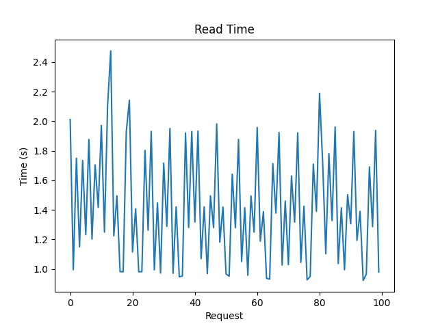
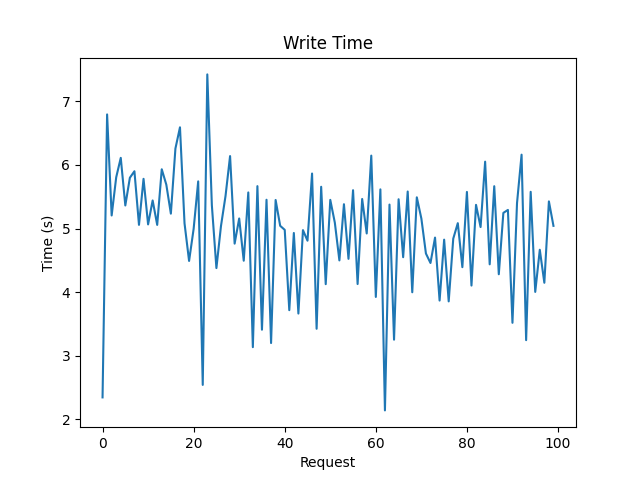
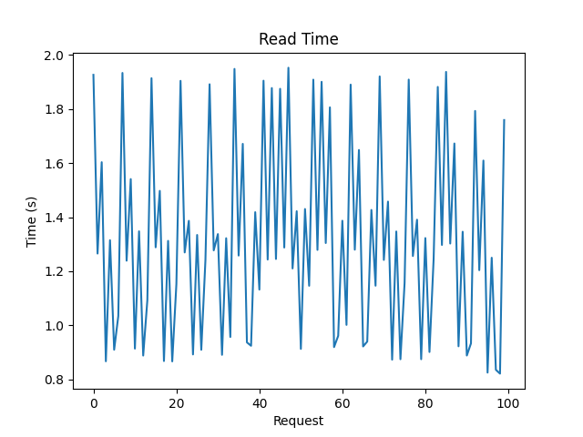
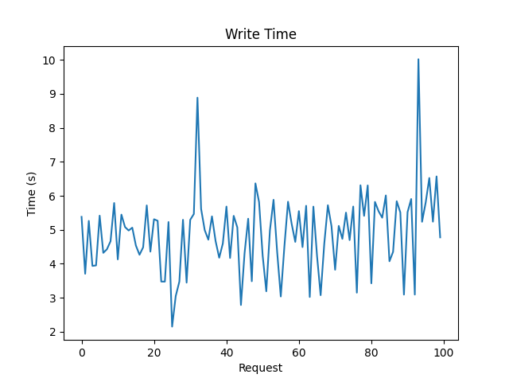
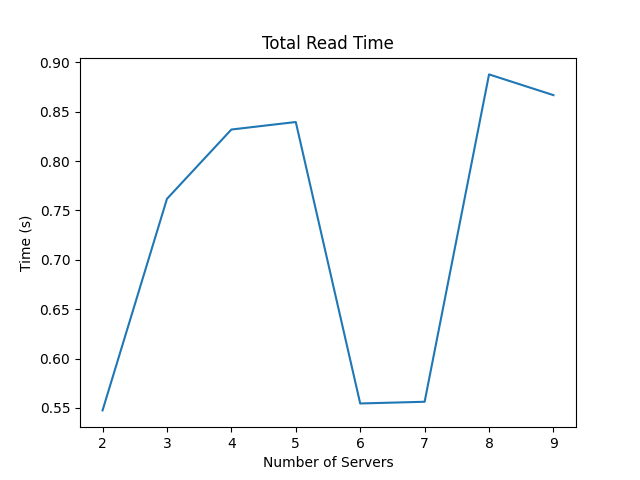

# Analysis and Design Documentation

## Overview
This assignment involves implementing a sharded database system for a single table `StudT`, distributed across multiple shards in different server containers. The system utilizes a `Write-Ahead Logging (WAL)` mechanism to ensure consistency among shard replicas across servers. Shards are subparts of the database managing a limited number of entries, with the ability to be replicated for parallel read operations.

## Design Choices
**Logging Mechanism**:  The WAL mechanism ensures that all changes to the database are logged before they are applied to the database. This ensures that the database can be recovered to a consistent state in case of a failure. 
Each server has a separate log file `WALOG.txt` to store changes made to the database. Each entry has following format:
```
<operation> <Stud_id> <Stud_name> <Stud_marks> 
```
In case of delete opearation, only `<Stud_id>` is stored.

**Metadata**: There is a separate container for storing mapping from `Stud_id` to `Shard_id` to `Server_id`. This metadata is accessed by both load balancer and shard manager. There are endpoints defined for updating and querying metadata.

**WAL** 
1. Primary server on receiving a CRUD request, it writes to WAL and sends corresponding request to secondary servers.
2. Secondary servers on receiving the request, write to their WAL.
3. On recovery, a secondary server asks primary server  of respective shards for latest WAL entries.
4. When primary server dies, the secondary server with most updated log takes over and becomes primary server. 

## API Endpoints
1. **Server**
    - `POST /write` : 
        - Primary server: makes change to log and send write request to other servers.
        - Secondary server: update log and write data entries in a shard.
    - `PUT /update` : updates a particular data entry in a shard in a particular server container.
    - `DELETE /del` : deletes a particular data entry (based on Stud id) in a shard in a particular server container.
    - `POST /read` : reads records between low and high Student IDs.
    - `GET /get_log_count` : gets the length of the server's logfile.
    - `GET /get_log` : gets the entire logfile of the server.
    - `POST /set_primary` : set the current server as primary and update metadata.


2. **Load Balancer**
    - `POST /init` : initialize the system with required number of shard replicas and server instances.
    - `GET /status` : gets status of system.
    - `POST /add` : add servers and shards to the system.
    - `DELETE /rm` : removes server instances in the load balancer.
    - `POST /read`
    - `POST /write`
    - `PUT /update`
    - `DELETE /del`


3. **Shard Manager**
    - `GET /primary_elect` : This route finds the servers that currently contain copies of a given shard as well the log sizes of each server. The server with the longest LogFile is set as the primary server.


4. **Metadata**
    - Multiple getter/setter functions to update common metadata. Each route has metadata locks applied.

## Steps to Run
1. Start system
```
sudo make build
sudo make up
```

2. Stop 
```
sudo make down
```

## Analysis

1. **The read and write speed for 1000 writes and 1000 reads in the default configuration given in task 2**
- Total read time: 141.71012997627258  seconds
- Total write time: 494.39242792129517  seconds  
- Average read time: 1.417101299762726  seconds
- Average write time: 4.943924279212951  seconds

    
    
    

2. **The read and write speed for 1000 writes and 1000 reads when the number of shard replicas is increased (to 7) from the configuration (init endpoint)**
- Total read time: 131.94010829925537  seconds
- Total write time: 488.73529505729675  seconds
- Average read time: 1.3194010829925538  seconds
- Average write time: 4.887352950572968  seconds

    
    
    

**Note - Average Read Time decreased in A2 in comparison to A1 whereas Average Write Time also decreased in A2 in comparison to A1 due to increase in the number of the shard replicas.**

3. **Increase the number of Servers (to 10) by adding new servers and increase the number of shards (shard to 6, shard replicas to 8). Define the (init endpoint) configurations according to your choice. Report the write speed up for 1000 writes and read speed up for 1000 reads.**

    

    

    

    